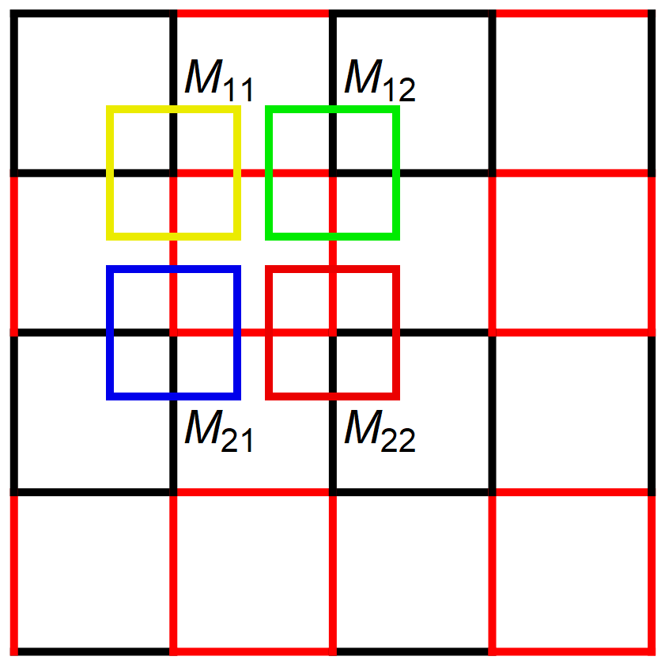

# ADBCVUMPS.jl

[](https://travis-ci.com/XingyuZhang2018/ADBCVUMPS.jl)
[](https://codecov.io/gh/XingyuZhang2018/ADBCVUMPS.jl)

This is a julia package to realise Automatic Differential(AD) for Big Cell Variational Uniform Matrix product states([BCVUMPS](https://github.com/XingyuZhang2018/BCVUMPS.jl)), which is a upgrade version of [ADVUMPS](https://github.com/XingyuZhang2018/ADVUMPS.jl) and they all have the same programming construct. So before using this package, you should be familar with those two packages.

For saving time to only do up vumps, this backage is limited for `2x2` big cell and `up and down symmetric` bulk tensor of constriction.

## install
```shell
> git clone https://github.com/XingyuZhang2018/ADBCVUMPS.jl
```
move to the file and run `julia REPL`, press `]` into `Pkg REPL`
```julia
(@v1.6) pkg> activate .
Activating environment at `..\ADBCVUMPS\Project.toml`

(ADVUMPS) pkg> instantiate
```
To get back to the Julia REPL, press `backspace` or `ctrl+C`. Then Precompile `ADBCVUMPS`
```julia
julia> using ADBCVUMPS
[ Info: Precompiling ADBCVUMPS [28ffd45a-d8fc-40b6-a096-198d7e880fe2]
```
## Example
If you want to learn deeply into this package, I highly recommend to run each single test in `/test/runtests` in sequence.

### Free Energy of the 2D Classical Ising Model
This package can direct auto differential function from [BCVUMPS](https://github.com/XingyuZhang2018/BCVUMPS.jl). So we can contract model tensor - `Ising(2,2)`, whose bulks are all same - by using  `bcvumps_env` to get BCVUMPS environment, then contract these to get the observable by using `Z`. 

Given the partition function, we get the free energy as the first derivative with respect to `β` times `-1`.
```julia
julia> using BCVUMPS:Z, bcvumps_env, Ising

julia> e = β -> -log(Z(bcvumps_env(Ising(2,2),β,10;verbose=true)))
#1 (generic function with 1 method)
```

With Zygote, this is straightforward to calculate:
```julia
julia> using Zygote

julia> Zygote.gradient(e,0.5)[1]
random initial bcvumps 2×2 environment-> bcvumps done@step: 10, error=3.411731413026125e-11
-1.7455645753126092
```

And test is using Finite difference:
```julia
julia> num_grad(e,0.5)
random initial bcvumps 2×2 environment-> bcvumps done@step: 11, error=3.486995025992917e-11
random initial bcvumps 2×2 environment-> bcvumps done@step: 11, error=6.069964731975723e-11
-1.7455645752839641
```

Then We consider a more complex model which need to use big cell. The configuration shows below:
<div align="center"></div>

The black line and red line means different coupling. So The cell is `2×2`:
<div align="center"></div>

```julia
julia> using BCVUMPS:Ising22

julia> e2 = β -> -log(Z(bcvumps_env(Ising22(2.0),β,10;verbose=true)))
#2 (generic function with 1 method)

julia> Zygote.gradient(e2,0.5)[1]
random initial bcvumps 2×2 environment-> bcvumps done@step: 4, error=7.931482185751766e-11
-2.960686088606506

julia> num_grad(e2,0.5)
random initial bcvumps 2×2 environment-> bcvumps done@step: 5, error=6.213908932837638e-12
random initial bcvumps 2×2 environment-> bcvumps done@step: 5, error=3.26568903381768e-11
-2.9606860886932647
```

### Finding the Ground State of infinite 2D Heisenberg model
The ground state of 2D Heisenberg model is antiferromagnetic, so the iPEPS is `2x2` checkerboard configuration. 

First, we need the hamiltonian as a tensor network operator and dispense `2x2` big cell.
```julia
julia> model = Heisenberg(2,2)
Heisenberg{Float64}(2, 2, 1.0, 1.0, 1.0)

julia> h = hamiltonian(model)
2×2×2×2 Array{Float64, 4}:
[:, :, 1, 1] =
 0.5   0.0
 0.0  -0.5

[:, :, 2, 1] =
 0.0  -1.0
 0.0   0.0

[:, :, 1, 2] =
  0.0  0.0
 -1.0  0.0

[:, :, 2, 2] =
 -0.5  0.0
  0.0  0.5
```
where we get the `Heisenberg`-hamiltonian with default parameters `Jx = Jy = Jz = 1.0`.

Next we initialize an bcipeps-tensor and calculate the energy of that tensor and the hamiltonian:
```julia
julia> bcipeps, key = init_ipeps(model; D=2, χ=20, tol=1e-10, maxiter=20);
random initial BCiPEPS

julia> energy(h, model, bcipeps; χ=20, tol=1e-10, maxiter=20, verbose=true)
random initial bcvumps 2×2 environment-> bcvumps done@step: 3, error=2.3639039391020674e-14
-0.49780617627363877
```
where the initial energy is random.

To minimise it, we combine Optim and Zygote under the hood to provide the optimiseipeps function. The key is used to save .log file and finial bcipeps .jld2 file.
```julia
julia> res = optimiseipeps(bcipeps, key; f_tol = 1e-6)
0.0   0   -0.4978061762736391   0.0399588773159167
7.2   1   -0.5017453433349557   0.015297433730151744
26.68   2   -0.6205669604009886   0.1736861861125378
32.48   3   -0.6293685135361665   0.07604380510255716
58.21   4   -0.6469236130427505   0.056858053631372
62.92   5   -0.6541647762716777   0.01984841402430646
77.73   6   -0.6588636696550104   0.01862668040156349
82.14   7   -0.6594942456654768   0.009031097699994842
89.32   8   -0.6597836447114301   0.004139170498045082
117.86   9   -0.6599324015052108   0.00511463313712612
132.31   10   -0.660099904072393   0.0024110064187308367
138.89   11   -0.6601311026595221   0.0013908602499431678
145.19   12   -0.6601717430549623   0.0007525434012148699
151.97   13   -0.6601853541805048   0.0009134870011324272
160.79   14   -0.6602021429493372   0.0009447709197415071
167.1   15   -0.66021014676881   0.0004702106182851674
175.56   16   -0.6602179873657269   0.0008253389376840389
181.92   17   -0.660221403953976   0.0001174047147439604
188.39   18   -0.6602218837440957   0.00015208509918559178
194.9   19   -0.660222478137628   0.0002049432063947152
 ───────────────────────────────────────────────────────────────────
                            Time                   Allocations      
                    ──────────────────────   ───────────────────────
  Tot / % measured:       265s / 93.2%            184GiB / 98.7%

 Section    ncalls     time   %tot     avg     alloc   %tot      avg
 ───────────────────────────────────────────────────────────────────
 backward       62     204s  82.5%   3.29s    142GiB  78.6%  2.30GiB
 forward        62    43.1s  17.5%   696ms   38.8GiB  21.4%   641MiB
 ───────────────────────────────────────────────────────────────────
 * Status: success

 * Candidate solution
    Final objective value:     -6.602225e-01

 * Found with
    Algorithm:     L-BFGS

 * Convergence measures
    |x - x'|               = 1.89e-03 ≰ 0.0e+00
    |x - x'|/|x'|          = 3.15e-03 ≰ 0.0e+00
    |f(x) - f(x')|         = 5.94e-07 ≰ 0.0e+00
    |f(x) - f(x')|/|f(x')| = 9.00e-07 ≤ 1.0e-06
    |g(x)|                 = 2.05e-04 ≰ 1.0e-08

 * Work counters
    Seconds run:   195  (vs limit Inf)
    Iterations:    19
    f(x) calls:    62
    ∇f(x) calls:   62

```
where our final value for the energy `e = -0.6602` agrees with the value found in [single cell](https://github.com/XingyuZhang2018/ADVUMPS.jl).